---


## begin
周末在海康做了一场 Midway Serverless 的基础展示以及落地巡检的一些实践，这也是 Midway Serverless 的一次介绍原理相关的内容，文字版记录如下。

这次分享的内容分为两部分， 一块是 Midway Serverless 的能力介绍，第二块是这些能力如何在巡检引擎项目中逐步落地。


本次分享的大纲分为几块内容

1 引入 serverless
2 介绍 midway serverless
3 第二版 巡检落地方案
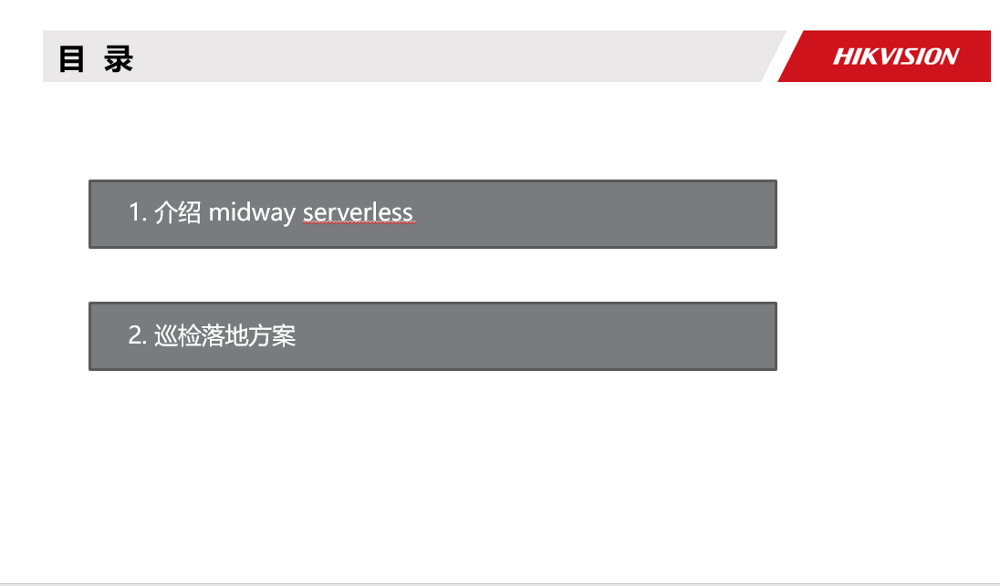

##  background


当前业界的 Serverless 化方向如火突入，有如阿里正在利用 Serverless 将原有业务迁移，降低成本的，也有正在向这些方向努力前进的，我首先会介绍一下当前 Serverless 的一些背景，前端使用 Serverless 的一些场景和方向。简单介绍一下 Midway Serverless 的一些基础上手和使用。并且介绍 Midway Serverless 在抹平平台差异，架构防腐层的一些设计。
最后是对未来的一些期望，方向的思考。

Midway 从 2014 年开始一直在集团承担 Node.js 应用的基础开发框架，最开始是 express，到后面的 koa，egg 体系等，将集团业务承载至今。最开始的前后端分离，到如今的函数化，都在不断的开拓前端职能，让业务更聚焦，开发更提效。

之前的 midway v1 版本，我们认为 midway 是一个 Web 全栈框架，提供 Web 服务，增加了依赖注入之后，也适合于大型应用的开发，灵活性和应用的可维护性也得到了验证。

而到了现在 Midway Serverless 时期，整个 Midway 框架的定位在逐步的变化。

第二大块的话 会介绍一下 巡检引擎中 midway的落地方案以及升级方案


## 目前很多前端同学都在学习 Serverless，很多文章和教程对 Serverless 都有不同方式的解读，今天我们首先来回顾4个问题：

#### Serverless能解决什么问题？
server是指服务端 他是serverless 解决问题的 边界 less 较少关心吧  较少关心服务端 
 
#### Serverless为什么很难定义？ 
服务免运维，意味整个服务端的运维极其抽象，serverless 对web 的改变是0基础也可搭建高性能服务器
 
#### 到底什么是serverless ？
跟同事们沟通 发现大家都这个概念比较模糊。 狭义的讲：Faas 架构 = Trgger驱动+faas＋baas（持久化的第三方服务）

广义就是服务端　免运维

我们该如何用serverless？

##  加州大学伯克利分校 2019 年 3 月份发表过一篇论文，名为《Cloud Programming Simplified: A Berkeley View on Serverless Computing

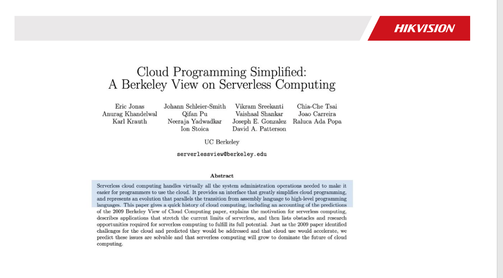

中文大意是：

「无服务器云计算（Serverless Computing）几乎封装了所有的底层资源管理和系统运维工作，使开发人员更容易使用云基础设施。它提供了一个方式，极大地简化了基于云服务的编程，犹如汇编语言到高级编程语言般的转换。」

这段话中举了一个例子非常生动：

#### Assembly Language to high-level programming Languages.

「Serverless 给云计算带来的改变，就是相当于从汇编语言到高级语言」。汇编语言，计算机专业的学生都有了解过。写汇编的话，首先需要了解 CPU 的结构，知道加法器、寄存器，需要自己管理内存、IO 设备等一些底层资源。但开发者的目的并非如此，开发者应该是以业务为导向的。而高级语言提供了诸多能力和框架支持，可以令开发者专注于更快地完成业务上的事情，这才是高级语言所具备的优点，而不是让开发者把精力浪费在底层资源管理。

由此可见，Serverless 的内涵就是对全部底层资源和运维工作的封装，让开发者专注于业务逻辑。

## faas


理解完 Serverless 的内涵，我们再来谈一下 FaaS（Function as a Service）的本质。一句话而言，FaaS 就是至今为止最细粒度的算力分配方式，我们先理解下什么叫算力分配方式。
当我们谈论计算机应用科学的时候，共有三个维度：“算力、算法、数据” 。在「算力」又有两个方向：一是如何让算力更强，让 CPU 运行得更快；二是如何让算力分配的更合理。传统计算机，从单任务实时操作系统到多任务分时操作系统，是解决算力的分配问题，云计算诞生的初衷以及要解决问题，也是解决巨大算力资源的合理化分配。云的算力分配方式主要是以什么为粒度的呢？
答案是虚拟机。
比机器再降维一点的分配粒度是什么？
答案是容器。
那比容器再降一级的功能是什么？
答案是函数。
最早期的算力分配是物理机为单元，后来是虚拟机和容器。这个算力分配细化的过程，也基本是云计算发展的过程。现在云上可以函数作为一个计算单元，变成每一次业务执行分配一次资源，没有业务就没有资源分配。所以，FaaS 是一个以函数（业务）为粒度的算力分

## 引子： Serverless中，很重要的一个点就是函数 例如一个接口调用

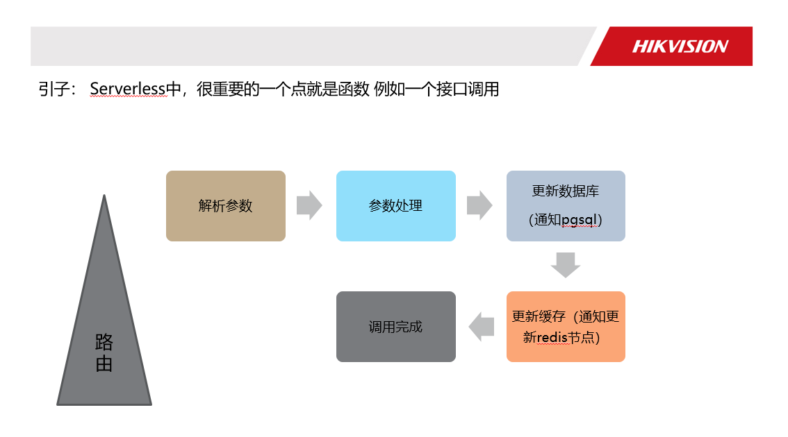
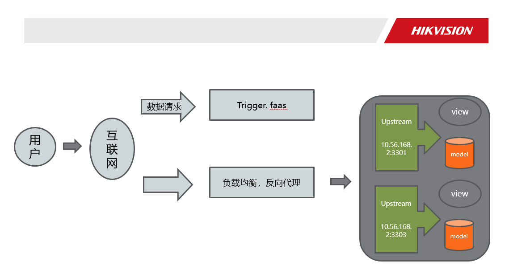

函数即时服务
我自己总结下：他需要我们从代码里加载到内存里，也就是实例化，然后被调用时执行
这是之前的做法
在faas中也是一样的函数需要实例化，然后触发器的trigger或者　其他函数调用，　区别在哪？
我认为是底下的runtime  faas的runtime是预先设置好的　你也可以理解成　这个runtime他会伴随著　函数一起销毁
函数掉用完后云服务商自动收回　我们回过去看这个图片　用我们熟悉的web应用举个例子mvc的c一般一个http会对应一个
controller函数　，我们就用faas来取代这个controller函数，因为http请求量大的时候faas函数会自动扩容，小的时候呢就缩容。
下一个ppt来解答　这个神奇的现象。
你可以很直观的想象，每个节点都是一个函数，处理完成后，将下个函数所需要的值传递过去，调用下一个函数（节点），这样过程非常清晰、逻辑独立，复用也更为简单。
所以Serverless的核心，就是讲究颗粒度，函数拆分到极致的细致

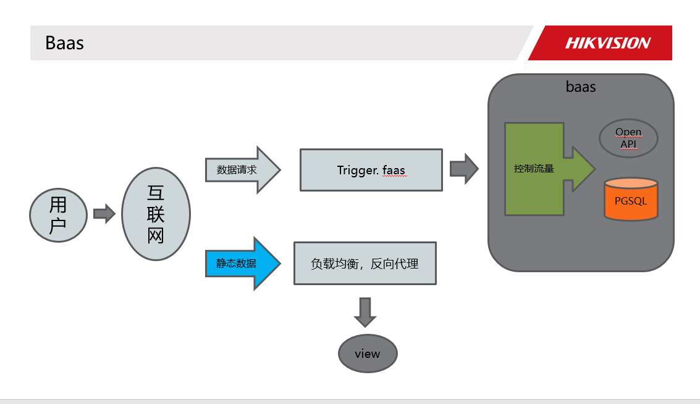

承接上一个页面的这个runtime，runtime不可控制，faas又是无状态的，数据持久化这一块怎么解决mvc的model又怎么解决。
举个例子　如果之前的后端服务是要散架的绿皮卡。baas就是为了faas准备的高铁车厢
Baas
我们用Baas来解决　　我们以pqsql作为例子，后端服务将数据库的命令　封装成http的openapi供faas调用
自己的话　控制这个api请求的平率和 限流降级　　这个后端服务本身可以可以通过连接池的配置，以及集群的方式去优化

各大云服务商上的baas也在日益壮大

## 云服务商会一直优化他们负责的部分慢的一般是下载代码，比如程序员吧代码同步上去了，　马上开始调度资源 下载代码的函数实例image请求第一次访问时　就可以用缓存好的image　　从镜像启动容器　预热冷启动

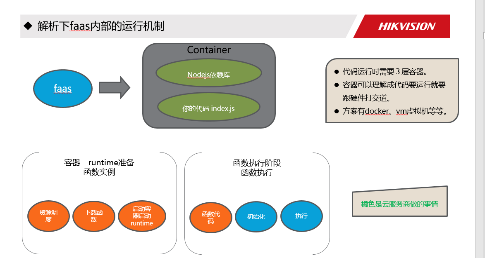


## 落地场景

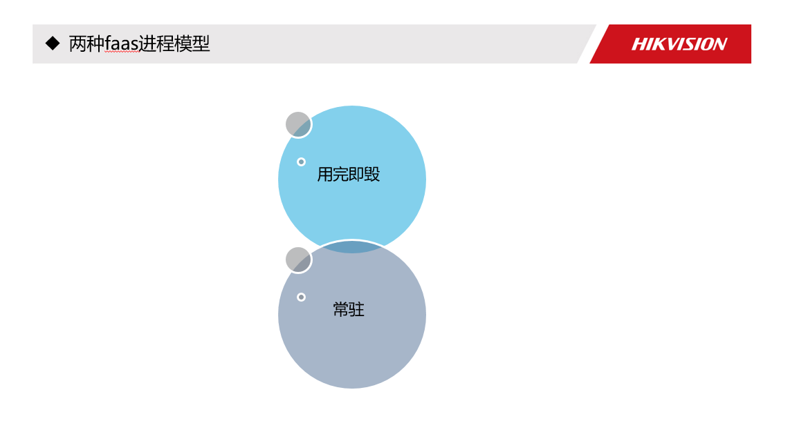

讲落地场景前 先想下承接上一张图能否不结束函数 让他被下一次函数调用 
用完即毁 
常驻但是一段时间不用还是会被回收的

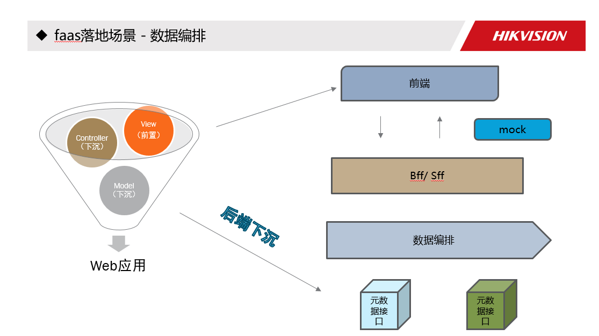
Faas只是做了极端抽象  
Bff 的话能想到 只做了无状态数据编排  因此 可以使用 faas 的 用完 立即立即毁掉的模型-》 既可以 
所以第一个应用场景 一定就是 编排 组件间通讯来的数据，和编排后端接口。


## 针对上面的场景分析 云函数 和 传统对比

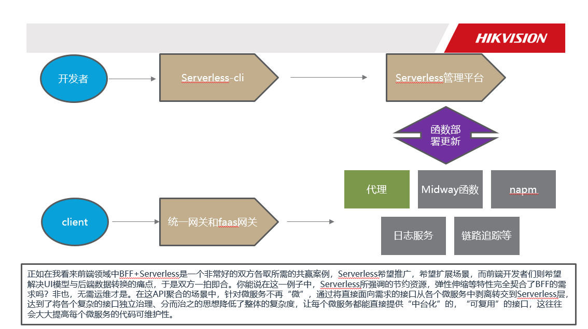

 serverless借助Kubernetes，底层资源编排

使用 serverless-cli 来完成本地创建、开发、调试、发布等用户操作

Serverless 管理平台集成了实时日志查看、全链路查询等实用功能，并提供了一些页面式函数操作


## 是否使用框架
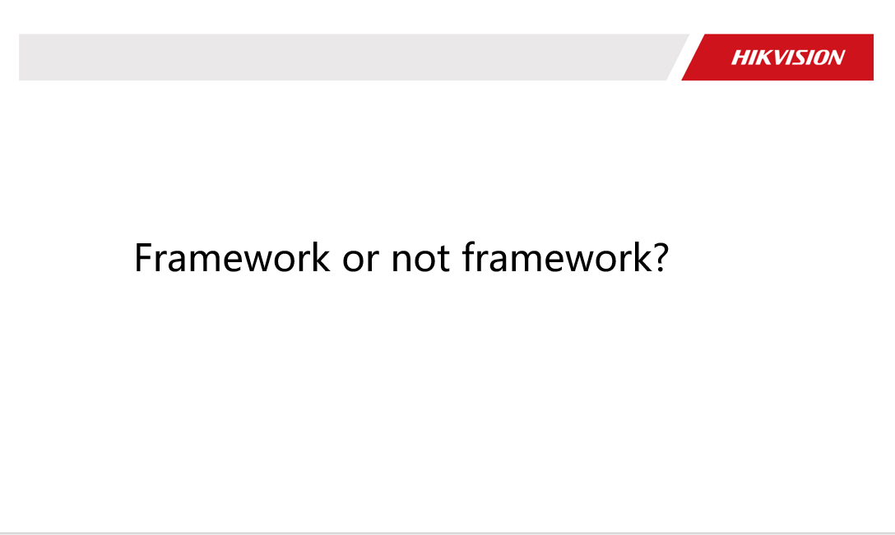

这边先举两个不使用框架的场景
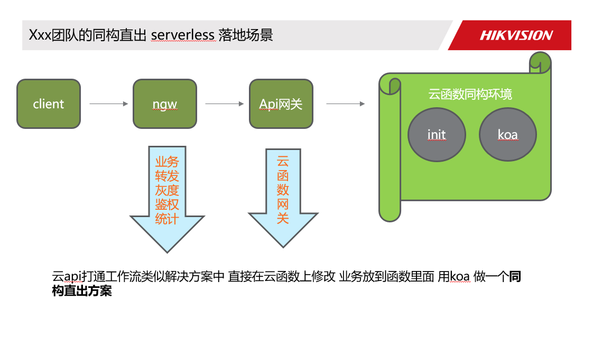
类似于解决方案的 直接在云函数上 业务放到函数里面 用koa 做一个同构直出方案 （服务端渲染并输出）

NGW 可以做到：
实现兜底逻辑： 云函数可能会 crash，这时候走静态页面接入机
灰度逻辑： 直出上现网的过程中可以通过 NGW 的配置进行部分灰度测试
链路日志收归： 长期以来，前端不好查具体的链路信息，现在有了 NGW 一切皆有可能

另外Serverless 函数会用于「响应 HTTP 请求」，即通过 HTTP 访问事件来触发云函数的执行


### 如何判断?
先清理下 ts-node 缓存。
在临时目录中有一个 ts-node-* 的目录，删除即可（不知道临时目录的可以在命令行执行 require('os').tmpdir() 输出查看


删了下面类似的这个目录。


### 用 ts-node 启动 Midway


```
// midway v1
cross-env DEBUG=midway* NODE_ENV=local midway-bin dev --ts

// midway v2
cross-env NODE_DEBUG=midway* NODE_ENV=local midway-bin dev --t

```

会出现每个文件的 require + bind的 时长


### 解决问题

由于 TS_NODE_TYPE_CHECK 内部会启动一个 Server，在文件特别的多的情况下，每次 require 都会做类型检查，如果造成严重启动影响，建议关闭。代价是启动运行时不会做类型校验，由于一般在编辑器里已经有提示，运行时不再做检查也可以。
在执行命令前增加下面两个环境变量。


### 在执行命令前增加下面两个环境变量

TS_NODE_TYPE_CHECK=false TS_NODE_TRANSPILE_ONLY=true


```
cross-env TS_NODE_TYPE_CHECK=false TS_NODE_TRANSPILE_ONLY=true DEBUG=midway* NODE_ENV=local midway-bin dev --ts

```


下面是使用相同的项目的对比效果。
第一次执行（无缓存）
第二次执行（有缓存）
不加优化参数
约 258s
约 5.6s
加优化参数
约 15s
约 4.7s

### 持续关注　https://bianbiandashen.github.io/　个人博客

 

