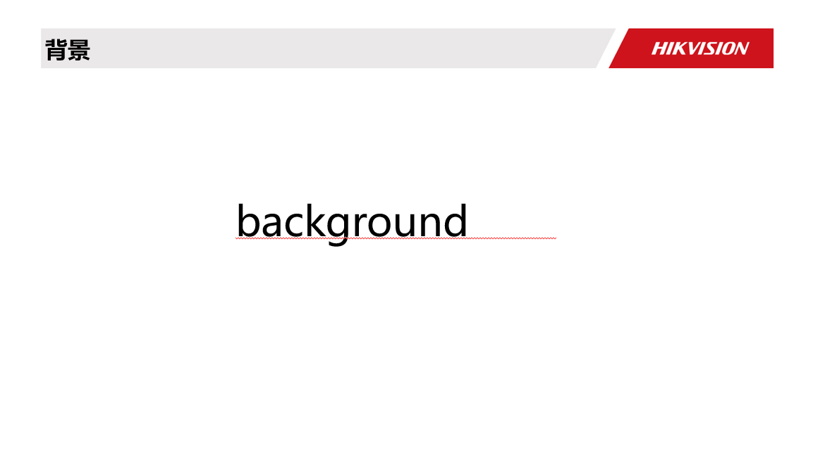
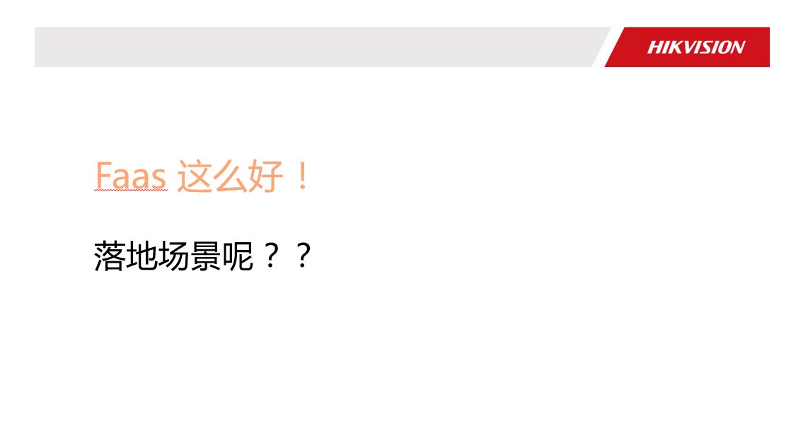

---

## begin
周末在海康做了一场 Midway Serverless 的基础展示以及落地巡检的一些实践，这也是 Midway Serverless 的一次介绍原理相关的内容，文字版记录如下。

这次分享的内容分为两部分， 一块是 Midway Serverless 的能力介绍，第二块是这些能力如何在巡检引擎项目中逐步落地。

本次分享的大纲分为几块内容

1 引入 serverless
2 介绍 midway serverless
3 第二版 巡检落地方案

##  background

当前业界的 Serverless 化方向如火突入，有如阿里正在利用 Serverless 将原有业务迁移，降低成本的，也有正在向这些方向努力前进的，我首先会介绍一下当前 Serverless 的一些背景，前端使用 Serverless 的一些场景和方向。简单介绍一下 Midway Serverless 的一些基础上手和使用。并且介绍 Midway Serverless 在抹平平台差异，架构防腐层的一些设计。
最后是对未来的一些期望，方向的思考。

Midway 从 2014 年开始一直在集团承担 Node.js 应用的基础开发框架，最开始是 express，到后面的 koa，egg 体系等，将集团业务承载至今。最开始的前后端分离，到如今的函数化，都在不断的开拓前端职能，让业务更聚焦，开发更提效。

之前的 midway v1 版本，我们认为 midway 是一个 Web 全栈框架，提供 Web 服务，增加了依赖注入之后，也适合于大型应用的开发，灵活性和应用的可维护性也得到了验证。

而到了现在 Midway Serverless 时期，整个 Midway 框架的定位在逐步的变化。

第二大块的话 会介绍一下 巡检引擎中 midway的落地方案以及升级方案

## 目前很多前端同学都在学习 Serverless，很多文章和教程对 Serverless 都有不同方式的解读，今天我们首先来回顾4个问题：

#### Serverless能解决什么问题？
server是指服务端 他是serverless 解决问题的 边界 less 较少关心吧  较少关心服务端 
 
#### Serverless为什么很难定义？ 
服务免运维，意味整个服务端的运维极其抽象，serverless 对web 的改变是0基础也可搭建高性能服务器
 
#### 到底什么是serverless ？
跟同事们沟通 发现大家都这个概念比较模糊。 狭义的讲：Faas 架构 = Trgger驱动+faas＋baas（持久化的第三方服务）

广义就是服务端　免运维

我们该如何用serverless？

##  加州大学伯克利分校 2019 年 3 月份发表过一篇论文，名为《Cloud Programming Simplified: A Berkeley View on Serverless Computing

中文大意是：

「无服务器云计算（Serverless Computing）几乎封装了所有的底层资源管理和系统运维工作，使开发人员更容易使用云基础设施。它提供了一个方式，极大地简化了基于云服务的编程，犹如汇编语言到高级编程语言般的转换。」

这段话中举了一个例子非常生动：

#### Assembly Language to high-level programming Languages.

「Serverless 给云计算带来的改变，就是相当于从汇编语言到高级语言」。汇编语言，计算机专业的学生都有了解过。写汇编的话，首先需要了解 CPU 的结构，知道加法器、寄存器，需要自己管理内存、IO 设备等一些底层资源。但开发者的目的并非如此，开发者应该是以业务为导向的。而高级语言提供了诸多能力和框架支持，可以令开发者专注于更快地完成业务上的事情，这才是高级语言所具备的优点，而不是让开发者把精力浪费在底层资源管理。

由此可见，Serverless 的内涵就是对全部底层资源和运维工作的封装，让开发者专注于业务逻辑。

## faas

理解完 Serverless 的内涵，我们再来谈一下 FaaS（Function as a Service）的本质。一句话而言，FaaS 就是至今为止最细粒度的算力分配方式，我们先理解下什么叫算力分配方式。
当我们谈论计算机应用科学的时候，共有三个维度：“算力、算法、数据” 。在「算力」又有两个方向：一是如何让算力更强，让 CPU 运行得更快；二是如何让算力分配的更合理。传统计算机，从单任务实时操作系统到多任务分时操作系统，是解决算力的分配问题，云计算诞生的初衷以及要解决问题，也是解决巨大算力资源的合理化分配。云的算力分配方式主要是以什么为粒度的呢？
答案是虚拟机。
比机器再降维一点的分配粒度是什么？
答案是容器。
那比容器再降一级的功能是什么？
答案是函数。
最早期的算力分配是物理机为单元，后来是虚拟机和容器。这个算力分配细化的过程，也基本是云计算发展的过程。现在云上可以函数作为一个计算单元，变成每一次业务执行分配一次资源，没有业务就没有资源分配。所以，FaaS 是一个以函数（业务）为粒度的算力分

## 引子： Serverless中，很重要的一个点就是函数 例如一个接口调用

函数即时服务
我自己总结下：他需要我们从代码里加载到内存里，也就是实例化，然后被调用时执行
这是之前的做法
在faas中也是一样的函数需要实例化，然后触发器的trigger或者　其他函数调用，　区别在哪？
我认为是底下的runtime  faas的runtime是预先设置好的　你也可以理解成　这个runtime他会伴随著　函数一起销毁
函数掉用完后云服务商自动收回　我们回过去看这个图片　用我们熟悉的web应用举个例子mvc的c一般一个http会对应一个
controller函数　，我们就用faas来取代这个controller函数，因为http请求量大的时候faas函数会自动扩容，小的时候呢就缩容。
下一个ppt来解答　这个神奇的现象。
你可以很直观的想象，每个节点都是一个函数，处理完成后，将下个函数所需要的值传递过去，调用下一个函数（节点），这样过程非常清晰、逻辑独立，复用也更为简单。
所以Serverless的核心，就是讲究颗粒度，函数拆分到极致的细致

承接上一个页面的这个runtime，runtime不可控制，faas又是无状态的，数据持久化这一块怎么解决mvc的model又怎么解决。
举个例子　如果之前的后端服务是要散架的绿皮卡。baas就是为了faas准备的高铁车厢
Baas
我们用Baas来解决　　我们以pqsql作为例子，后端服务将数据库的命令　封装成http的openapi供faas调用
自己的话　控制这个api请求的平率和 限流降级　　这个后端服务本身可以可以通过连接池的配置，以及集群的方式去优化

各大云服务商上的baas也在日益壮大

## 云服务商会一直优化他们负责的部分慢的一般是下载代码，比如程序员吧代码同步上去了，　马上开始调度资源 下载代码的函数实例image请求第一次访问时　就可以用缓存好的image　　从镜像启动容器　预热冷启动

## 落地场景

讲落地场景前 先想下承接上一张图能否不结束函数 让他被下一次函数调用 
用完即毁 
常驻但是一段时间不用还是会被回收的

Faas只是做了极端抽象  
Bff 的话能想到 只做了无状态数据编排  因此 可以使用 faas 的 用完 立即立即毁掉的模型-》 既可以 
所以第一个应用场景 一定就是 编排 组件间通讯来的数据，和编排后端接口。

## 针对上面的场景分析 云函数 和 传统对比

 serverless借助Kubernetes，底层资源编排

使用 serverless-cli 来完成本地创建、开发、调试、发布等用户操作

Serverless 管理平台集成了实时日志查看、全链路查询等实用功能，并提供了一些页面式函数操作

## 是否使用框架

这边先举两个不使用框架的场景

类似于解决方案的 直接在云函数上 业务放到函数里面 用koa 做一个同构直出方案 （服务端渲染并输出）

NGW 可以做到：
实现兜底逻辑： 云函数可能会 crash，这时候走静态页面接入机
灰度逻辑： 直出上现网的过程中可以通过 NGW 的配置进行部分灰度测试
链路日志收归： 长期以来，前端不好查具体的链路信息，现在有了 NGW 一切皆有可能

另外Serverless 函数会用于「响应 HTTP 请求」，即通过 HTTP 访问事件来触发云函数的执行

这个场景下也就是Bff 层 在云函数这一层  函数之上去处理业务

## 使用Serverless framework框架

组件化里面的化将我们熟悉的node框架做了一个整合，那么在底层一些它又将开发调试部署监控等做了框架的标准化

开发应用 不管云底层的服务 ，组件化可以复用

底下这一层 开发部署调式 上面一层是对应的解决方案，我们不是因为  serverles 都改成 函数，faas 只是 计算资源的组织方式

继续往下走 看看serverless的这些命令行 我们能看到install depoly rolllback等等

来一起看一个使用Serverless cli 完成一个静态网站

一个静态网站包括什么：
其时里面包含的东西很多 http server，ssl证书需要自己申请，或者搭建一个webserver 要cdn 流量大了，域名的cnmae 进程死了，日志，还有数据的挖掘，
serverless 包含了这一切

现在一个墙上的所有都可以产品化的上云 有 python ，当然最多的还是node相关的
那么koa egg 会不会支持 社区的同学已经做了 

##  在回顾serverless cli 好处

以前开发要模拟bakend 没有线上线下，只有线上环境间隔离，
远程调试 在远程起一个debugger 
数据的 serverless化
其实部署很简单，但是平时上线的时候很麻烦要一句句去打log debug，因此serverless 可以远程调试 ，还有数据的serverlessdb 化

自己总结下：
端和 Serverless 的确是不解之缘，只有 Serverless 能够真正让一个前端工程师去挑大梁，Full-Stack 完成一个产品；
Serverless 前端工程化的基本思路，直接在云厂商的云函数上自己去做，还是基于现有的 Serverless Framework；
讲了一些 Serverless Framework 的原理，包括底层以标准化方式对云厂商接口的支撑，上层是利用 Serverless 的组件化，进行业务复用，提升效率；
##  引入主体 midway serverless

这里想往广度上给大家 普及一下

首先，Midway Serverless 是一个 serverless framework，可以在让代码在多云平台部署，在用户选择时可以减少一些顾虑。
第二是能够方便的让传统的应用迁移上现有的弹性服务，毕竟在集团内，还有非常多的传统应用，不管是在什么场景，这些应用都还需要人维护，需要占用大量的资源，如果能上弹性，对节省成本有非常大的好处。
第三是让应用本身能够在传统应用和函数之间切换，传统的 midway 是基于装饰器加上依赖注入的特性构建出来的，在函数体系下上，也可以这样做，甚至于通过构建将不同的场景结合到一起，我们希望最后能达到代码不变的情况下，不同场景都可用的状态。

## 我把midway serverless 的结构抽象了下

这里的 f.yml 就承载了之前的路由层的功能，在 Serverless（FaaS）体系中，路由交给了网关处理，那么我们只需要在项目代码中写对应的原 Controller 的内容即可。
如图所示，f.yml 中每一个服务都会对应一个接口，每个接口都由一个方法承载由 handler 字段去映射绑定，而实际运行中，通过依赖注入的方式，框架只根据当前执行的逻辑动态初始化其中方法，所以也不需要担心执行的性能问题。

f.yml 通过标准化适配多云平台，最简单的来说，可以通过定义 http 触发器的 path 和 method 具体的指定接口地址，也可以简化到默认值，自动变为通配路由等等

midway faas 支持社区各个平台的触发器，为了更好的标准化和复用，我们将一些平台的触发器的名字做了转化，在 f.yml 中呈现
service  当前的服务（函数分组），对标应用provider 当前的服务提供商，比如 aliyun，tencent 等。functions 函数的具体信息layers 具体的layer 层配置resources  引用的资源plugins  引用的插件，serverless 预留aggregation 聚合部署字段package  构建的配置信息custom 其他自定义信息

上面一般还有个 provider 便于切换云服务运营商 。

Midway 的faas 强大就在与他的工具链 本地触发云端事件
## 一体化应用发布 

目前支持创建 React 项目，Vue 等其它框架支持也将在近期推出，请保持关注
$ f create --template-package=@midwayjs-examples/midway-hooks-react
我们在本地可以通过 npm start 来启动，启动时会自动发一个请求到函数端拿数据，渲染到页面，访问 http://127.0.0.1:3000/ ，整体效果如下

## 结合一个Serverless + Hooks 的云端一体化实践方案, 告诉大家在应用和函数部署之间切换的 framework的意义
通过 hooks 传递context 而非手动去指定参数 
多函数支持可在同一个仓库里并发，且支持不同函数同代码的复用 当然路由都的根都在index所以需要祝一路有冲突
在整个过程中你无需关心调用细节于手动创建 ajax请求，midway hooks会处理好一切，前后端数据通信，从此和调用普通函数一样简单

## 函数是怎么run 起来的

虽然给大家展示了开发的工具链，开发的标准，解释了运行时机制，大家是不是还是很疑惑，依赖注入是如何把 f.yml 中的 handler 字段如何与代码中对应的装饰器连接的，而函数整个原来的参数是如何和云平台对接，做到一套代码跨多平台的? 
 

Midway v1 是基于 EggJS 往上扩展，增加 IoC（依赖注入） 容器的初始化部分，并且将装饰器的能力注册到其中，和整个路由体系结合到一起。

虽然给大家展示了开发的工具链，开发的标准，解释了运行时机制，大家是不是还是很疑惑，依赖注入是如何把 f.yml 中的 handler 字段如何与代码中对应的装饰器连接的，而函数整个原来的参数是如何和云平台对接，做到一套代码跨多平台的? 

路由部分也是这种逻辑的其中一层，在调用路由时，获取到对应的 Controller key，找到对应的方法，整个 Midway v1 都是如此运行起来的。
在之后的迭代过程中，我们发现这样和单一框架依赖会比较深，很难去灵活的调整功能，并且在 Web 场景的能力，很难去适配到其他场景，这就给逻辑的复用和扩展造成了不少困难。
我们希望不同的场场景的代码，能够在一定程度上能够复用，比如常见的 router/orm/graphql 等等，都是可以横跨不同的场景去复用的，甚至于用户的服务层代码本身也是可以去多处复用的。另外一块，我们希望传统全栈到 Serverless 的过程是有延续性的，不希望代码的写法有比较大的区别，既能在不同的平台通用，又能在不同的技术栈大部分通用。

for web，扩展不易 
耦合性
路由部分也是这种逻辑的其中一层，在调用路由时，获取到对应的 Controller key，找到对应的方法，整个 Midway v1 都是如此运行起来的。

在之后的迭代过程中，我们发现这样和单一框架依赖会比较深，很难去灵活的调整功能，并且在 Web 场景的能力，很难去适配到其他场景，这就给逻辑的复用和扩展造成了不少困难。

下面重点讲一下 为啥能run 函数？

整个原始的入口函数，社区的写法都非常简单，是一个传统的方法，其参数在不同平台根据不同触发器略有不同。
在执行时，通过网关调度到其内部的运行时，然后拼装参数执行到用户的入口函数中。

为了和之前的框架结合，以及屏蔽不同平台之间的差异，我们在社区的运行时执行之后，用户入口函数之前，做了一层架构抽象，即我们所谓的”防腐层“。这层一共包括两个功能，一是运行时防腐的部分，屏蔽出入参数差异，屏蔽异步差异，错误处理等等。第二部分是 API 传承，将传统的 Midway v1 的容器初始化，根据 yml 里的信息实例化对应的函数方法

通过 event 关联 container 和 tiggers

先用多触发器磨平

初始化的时候，我们会做两个事情，一个就是每个平台的适配器，会自动根据 f.yml 中配置的 provider.name 来生成，我们会自动提供支持的平台启动器（现在已经有阿里云，腾讯云，以及即将完成的 aws）。
另外一个就是 Midway Serverless 框架的入口（FaaSStarter），通过它，来调用到实际的用户代码(src/index.ts）。其余的 asyncWrapper 和 asyncEvent 则是用于对异步函数的包裹，让代码可以统一用上 async 关键字。

## 巡检落地方案 

schema是用于定义对应的数据表结构的
改成ts ,通过moudle.exports 导出，映射数据库表和字段。
支持对数据库的正向和逆向导入导出

model层需要解决的是 

改成 ts .通过 moudle.exports 用装饰器＠model配合 service　统一处理所有数据库操作

在 class 中挂载 app 实例，解决在装饰器中通过 ctx 获取 app 的频繁调用线程过载问题

## ioc的概念在这边引入一下
软件系统在引入IOC容器之后，这种情形就完全改变了，如右图所示，由于IOC容器的加入，对象A与对象B之间失去了直接联系，所以，当对象A运行到需要对象B的时候，IOC容器会主动创建一个对象B注入到对象A需要的地方。

controller 部分的话 
改成ts .通过ioc获取service实例然后调用对应方法，结合自定义的swagger的decoractor

由于midway暂未支持swagger 因此自己改写了一套swagger，同时入参出参需要typings/api中定义

## 总结

从引入serverless 的概念到serverless 当前的有无框架的不同实践方式演示，
再到我们的主体midway serverless 的引出，强调了midway serverless的运行时是在这些平台内置的运行时之上的封装，并且将运行时和业务代码通过自定义生命周期进行关联，将整个代码 run 起来的 最后讲述了海康巡检引擎开始引入midway 的实践方案
### 持续关注　https://bianbiandashen.github.io/　个人博客

 

